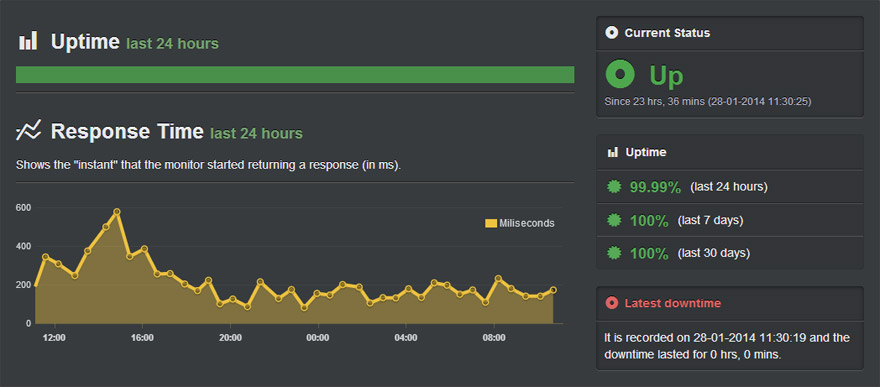
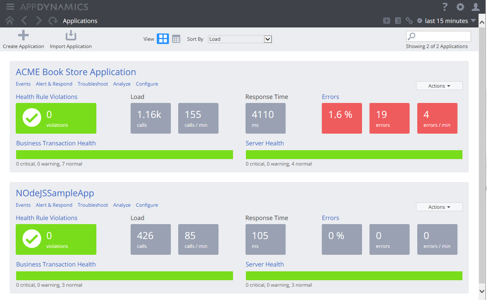

# 使用 APM 产品发现错误和宕机时间

### 一段解释

异常 != 错误。传统的错误处理假定存在异常，但应用程序错误可能以代码路径慢，API停机，缺少计算资源等形式出现。因为APM产品允许使用最小的设置来先前一步地检测各种各样 "深埋" 的问题，这是运用它们方便的地方。APM产品的常见功能包括: 当HTTP API返回错误时报警, 在API响应时间低于某个阈值时能被检测, 觉察到‘code smells’，监视服务器资源，包含IT度量的操作型智能仪表板以及其他许多有用的功能。大多数供应商提供免费方案。

### 关于 APM 的维基百科

在信息技术和系统管理领域, 应用程序性能管理(APM)是对软件应用程序的性能和可用性的监视和管理。APM努力检测和诊断复杂的应用程序性能问题, 以维护预期的服务级别。APM是"将IT度量标准转换为业务含义"

### 了解 APM 市场

APM 产品由3个主要部分构成:

1. 网站或API监控 – 通过HTTP请求不断监视正常运行时间和性能的外部服务。可以在几分钟内安装。以下是少数选定的竞争者: [Pingdom](https://www.pingdom.com/), [Uptime Robot](https://uptimerobot.com/), 和[New Relic](https://newrelic.com/application-monitoring)；

2. 代码检测 – 这类产品需要在应用程序中嵌入代理, 以实现如检测运行缓慢的代码、异常统计、性能监视等功能。以下是少数选定的竞争者: New Relic, App Dynamics；

3. 操作型智能仪表板 – 这些产品系列侧重于为ops团队提供度量和管理内容, 帮助他们轻松地保持应用程序性能维持在最佳状态。这通常涉及聚合多个信息源 (应用程序日志、DB日志、服务器日志等) 和前期仪表板设计工作。以下是少数选定的竞争者: [Datadog](https://www.datadoghq.com/), [Splunk](https://www.splunk.com/), [Zabbix](https://www.zabbix.com/)；

 ### 示例: UpTimeRobot.Com – 网站监控仪表板

 ### 示例: AppDynamics.Com – 与代码检测结合的端到端监视

