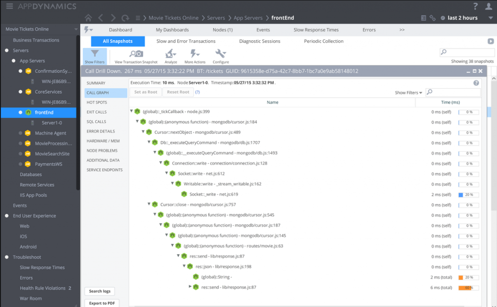

# Sure user experience with APM products

  

### One Paragraph Explainer

APM (application performance monitoring) refers to a family of products that aims to monitor application performance from end to end, also from the customer perspective. While traditional monitoring solutions focus on Exceptions and standalone technical metrics (e.g. error tracking, slow server endpoints, etc), in the real world our app might create disappointed users without any code exceptions, for example, if some middleware service performed real slow. APM products measure the user experience from end to end, for example, given a system that encompasses frontend UI and multiple distributed services – some APM products can tell how fast a transaction that spans multiple tiers last. It can tell whether the user experience is solid and point to the problem. This attractive offering comes with a relatively high price tag hence it’s recommended for large-scale and complex products that require going beyond straightforward monitoring.

  

### APM example – a commercial product that visualizes cross-service app performance

  

### APM example – a commercial product that emphasizes the user experience score

  

### APM example – a commercial product that highlights slow code paths

