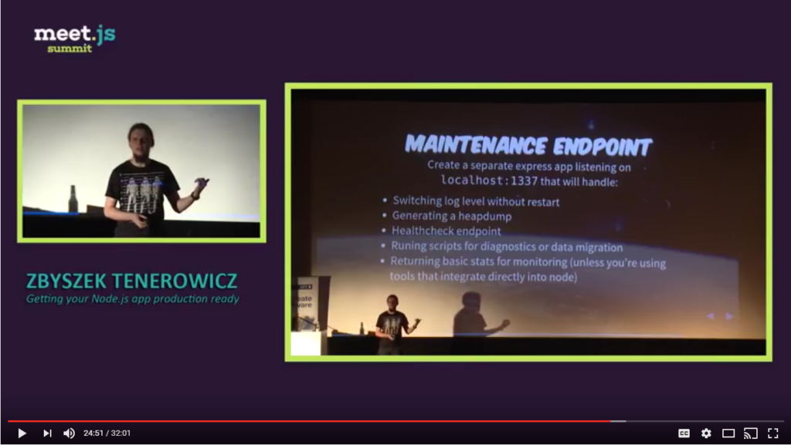

# 创建维护端点

<br/><br/>


### 一段解释

维护端点是一个简单的安全的HTTP API, 它是应用程序代码的一部分, 它的用途是让ops/生产团队用来监视和公开维护功能。例如, 它可以返回进程的head dump (内存快照), 报告是否存在内存泄漏, 甚至允许直接执行 REPL 命令。在常规的 devops 工具 (监视产品、日志等) 无法收集特定类型的信息或您选择不购买/安装此类工具时, 需要使用此端点。黄金法则是使用专业的和外部的工具来监控和维护生产环境, 它们通常更加健壮和准确的。这就意味着, 一般的工具可能无法提取特定于node或应用程序的信息 – 例如, 如果您希望在 GC 完成一个周期时生成内存快照 – 很少有 npm 库会很乐意为您执行这个, 但流行的监控工具很可能会错过这个功能。

<br/><br/>


### 代码示例: 使用代码生产head dump

```javascript
var heapdump = require('heapdump');
 
router.get('/ops/headump', (req, res, next) => {
    logger.info(`About to generate headump`);
    heapdump.writeSnapshot(function (err, filename) {
        console.log('headump file is ready to be sent to the caller', filename);
        fs.readFile(filename, "utf-8", function (err, data) {
            res.end(data);
        });
    });
});
```

<br/><br/>

### 推荐资源

[Getting your Node.js app production ready (Slides)](http://naugtur.pl/pres3/node2prod)

▶ [Getting your Node.js app production ready (Video)](https://www.youtube.com/watch?v=lUsNne-_VIk)


