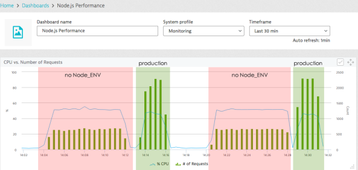

# Установите NODE_ENV = production

<br/><br/>

### Объяснение в один абзац

Переменные среды - это набор пар ключ-значение, предоставляемых любой работающей программе, обычно для целей конфигурации. Хотя могут использоваться любые переменные, Node поощряет соглашение об использовании переменной с именем NODE_ENV, чтобы указать, находимся ли мы в данный момент в производстве. Это определение позволяет компонентам обеспечивать лучшую диагностику во время разработки, например, путем отключения кэширования или выдачи подробных операторов журнала. Любой современный инструмент развертывания - Chef, Puppet, CloudFormation и другие - поддерживает настройку переменных среды во время развертывания.

<br/><br/>

### Пример кода: установка и чтение переменной среды NODE_ENV

```shell script
// Setting environment variables in bash before starting the node process
$ NODE_ENV=development
$ node
```

```javascript
// Reading the environment variable using code
if (process.env.NODE_ENV === 'production')
    useCaching = true;
```

<br/><br/>

### Что говорят другие блоггеры

Из блога [dynatrace](https://www.dynatrace.com/blog/the-drastic-effects-of-omitting-node_env-in-your-express-js-applications/):
> ... В Node.js существует соглашение об использовании переменной NODE_ENV для установки текущего режима. Мы видим, что на самом деле он читает NODE_ENV и по умолчанию принимает значение "development", если он не установлен. Мы ясно видим, что установив NODE_ENV в рабочее состояние, количество запросов Node.js может обрабатывать скачки примерно на две трети, в то время как загрузка ЦП даже немного падает. *Позвольте мне подчеркнуть это: установка NODE_ENV в рабочий режим делает ваше приложение в 3 раза быстрее!*



<br/><br/>
