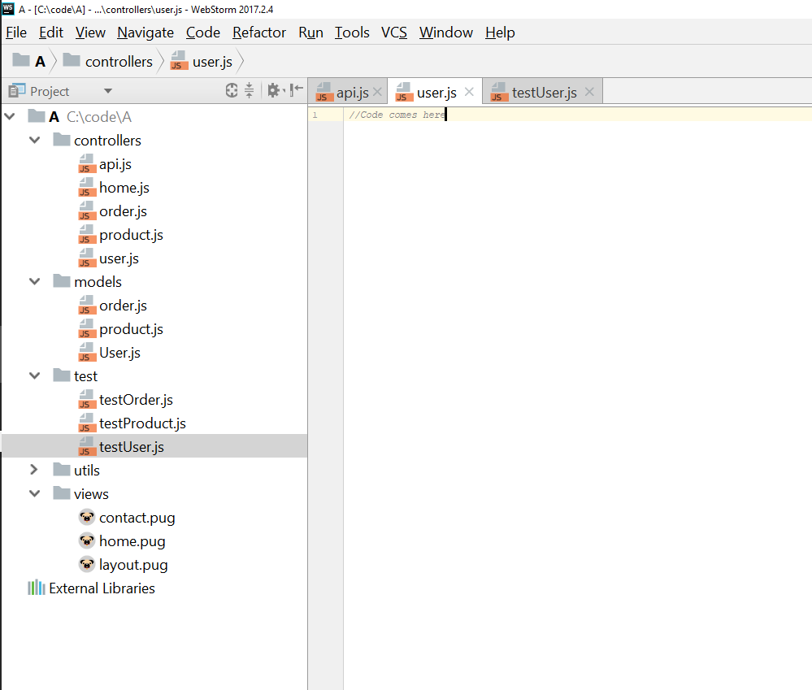

# Structure your solution by components

  

### One Paragraph Explainer

For medium sized apps and above, monoliths are really bad - one big software with many dependencies is just hard to reason about and often leads to code spaghetti. Even those smart architects who are skilled to tame the beast and 'modularize' it - spend great mental effort on design and each change requires to carefully evaluate the impact on other dependent objects. The ultimate solution is to develop small software: divide the whole stack into self-contained components that don't share files with others, each constitutes very few files (e.g. API, service, data access, test, etc) so that it's very easy to reason about it. Some may call this 'microservices' architecture - it's important to understand that microservices are not a spec which you must follow rather a set of principles. You may adopt many principles into a full-blown microservices architecture or adopt only a few. Both are good as long as you keep the software complexity low. The very least you should do is create basic borders between components, assign a folder in your project root for each business component and make it self-contained - other components are allowed to consume its functionality only through its public interface or API. This is the foundation for keeping your components simple, avoid dependencies hell and pave the way to full-blown microservices in the future once your app grows

  

### Blog Quote: "Scaling requires scaling of the entire application"

 From the blog MartinFowler.com

 > Monolithic applications can be successful, but increasingly people are feeling frustrations with them - especially as more applications are being deployed to the cloud. Change cycles are tied together - a change made to a small part of the application requires the entire monolith to be rebuilt and deployed. Over time it's often hard to keep a good modular structure, making it harder to keep changes that ought to only affect one module within that module. Scaling requires scaling of the entire application rather than parts of it that require greater resource.

   

### Good: Structure your solution by self-contained components

   

### Bad: Group your files by technical role

