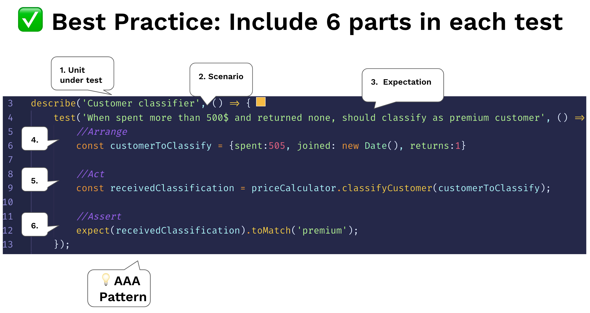

# Egitura probak AAA ereduaren arabera

<br/><br/>

### Azalpena

Probak egiterakoan daukagun erronka handiena memoriako espazio falta da, dagoeneko ekoizpen kodeak oso lanpetuta gauzka. Horregatik, proben kodeak sinplea eta ulergarria izan behar du. Probak irakurtzean, ez luke eman beharko kode inperatiboa irakurtzen ari zarela (begiztak, oinordetza), HTML moduan, esperientzia deklaratibo bat baizik. Hori lortzeko, erabili AAA eredua, irakurtzaileek probaren asmoa esfortzu gabe uler dezaten. Badaude hori bezalako beste eredu batzuk ere, adibidez: XUnit 'Prestatu, Aritu, Egiaztatu eta Eraitsi' ('Setup, Excercise, Verify, Teardown'). Hauek dira hiru Ak:

Lehenengo A, prestatu: hau da, prestatu kodea probak simulatu nahi duen egoeran jartzeko sistema. Horrek, besteak beste, eraikitzailearen unitate proba egitea eska lezake, datu basean erregistroak gehitzea, objektuen  mock-ak/stub-ak eta beste edozein prestakuntza kode eranstea

Bigarren A, jokatu: exekutatu zure unitate proba. Normalean kode ilara bat izaten da

Hirugarren A, baieztatu: ziurtatu jasotako balioak espero ziren modukoak direla. Normalean kode ilara bat izaten da
<br/><br/>

### Kode adibidea: AAA ereduaz egituratutako proba bat

```javascript
describe.skip("Bezero klasifikatzailea", () => {
  test("Bezeroak 500$ baino gehiago gastatzen dituenean, premium gisa klasifikatua izan behar da", () => {
    //Prestatu
    const klasifikatzekoBezeroa = { gastatuak: 505, sortua: new Date(), id: 1 };
    const DBAntzeratua = sinon
      .stub(dataAccess, "berreskuratuBezeroa")
      .reply({ id: 1, klasifikazioa: "arrunta" });

    //Jokatu
    const jasotakoKlasifikazioa = bezeroKlasifikatzailea.klasifikatuBezeroa(
      klasifikatzekoBezeroa
    );

    //Baieztatu
    expect(jasotakoKlasifikazioa).toMatch("premium");
  });
});
```

<br/><br/>

### Kode adibidea, anti eredua: bereizketarik ez, bloke bakarra, ulertzeko zailagoa

```javascript
test("Premium gisa klasifikatua izan beharko litzateke", () => {
  const klasifikatzekoBezeroa = { gastatuak: 505, sortua: new Date(), id: 1 };
  const DBAntzeratua = sinon
    .stub(dataAccess, "berreskuratuBezeroa")
    .reply({ id: 1, klasifikazioa: "arrunta" });
  const jasotakoKlasifikazioa = bezeroKlasifikatzailea.klasifikatuBezeroa(
    klasifikatzekoBezeroa
  );
  expect(jasotakoKlasifikazioa).toMatch("premium");
});
```

<br/><br/>

### "Erabili 6 zati proba bakoitzean"

["30 Node.jsren proba jarraibide egokiak" blogetik hartua, Yoni Goldbergen eskutik](https://medium.com/@me_37286/yoni-goldberg-javascript-nodejs-testing-best-practices-2b98924c9347)



<br/><br/>

### "Garrantzitsua da proba irakurtzen duen pertsonarentzat, probak zein jokaera egiaztatzen duen errez jakitea"

[XUnit Patterns](http://xunitpatterns.com/Four%20Phase%20Test.html) liburutik:

> Garrantzitsua da proba irakurtzen duen pertsonarentzat, proba zein jokaera egiaztatzen ari den azkar jakiteko gai izatea. Oso nahasgarria izan daiteke jokaera ugari probaren barruan (SUT) deituak izatea, batzuk SUTaren proba aurreko egoera prestatzeko (instalazioa), beste batzuk SUTa jokatzeko eta beste batzuk SUTaren proba ondorengo egoera egiaztatzeko. Lau faseak modu argian identifikatzeak probaren asmoa ikustea askoz errazago egiten dute.
