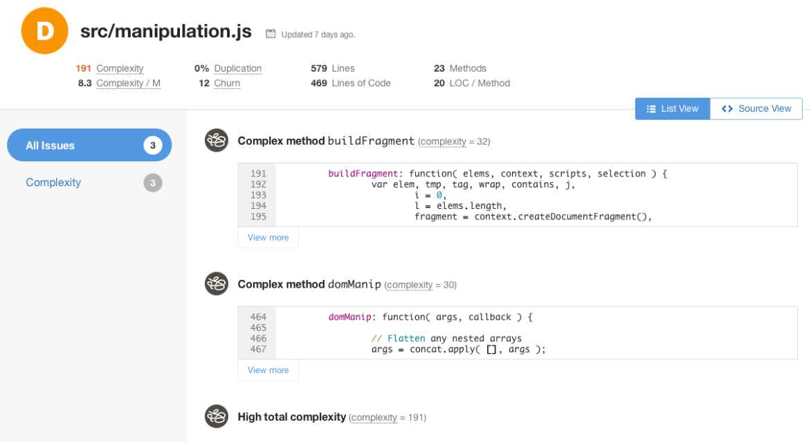
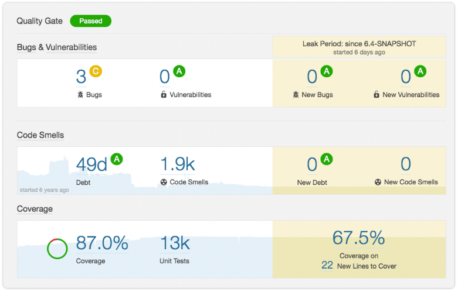

# Refactoring

  

### One Paragraph Explainer

Refactoring is an important process in the iterative development flow. Removing "Code Smells" (bad coding practices) such as Duplicated Code, Long Methods, Long Parameter list will improve your code and making it more maintainable. Using a static analysis tools will assist you in finding these code smells and build a process around refactoring. Adding these tools to your CI build will help automate the quality checking process. If your CI integrates with a tool like Sonar or Code Climate, the build will fail if it detects code smells and inform the author on how to address the issue. Theses static analysis tools will complement lint tools such as ESLint. Most linting tools will focus on code styles like indentation and missing semicolons (although some will find code smells like Long functions) in a single file while static analysis tools will focus on finding code smells (duplicate code, complexity analysis, etc) that are in single files and multiple files.

  

### Martin Fowler - Chief Scientist at ThoughtWorks

 From the book, "Refactoring - Improving the Design of Existing Code"

 > Refactoring is a controlled technique for improving the design of an existing code base.

  

### Evan Burchard - Web Development Consultant and Author

 From the book, "Refactoring JavaScript: Turning Bad Code into Good Code"

 > No matter what framework or
“compiles-to-JS” language or library you use, bugs and performance concerns
will always be an issue if the underlying quality of your JavaScript is poor.

  

 ### Example: Complex methods analysis with CodeClimate (commercial)

### Example: Code analysis trends and history with CodeClimate (commercial)

### Example: Code analysis summary and trends with SonarQube (commercial)

  
